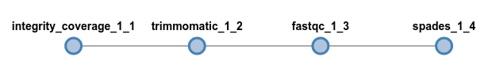
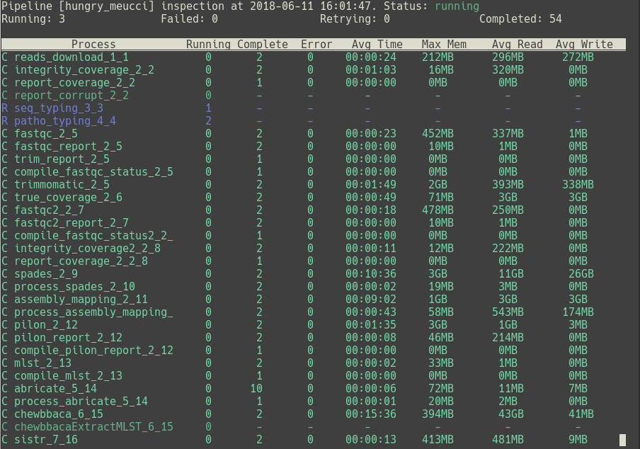
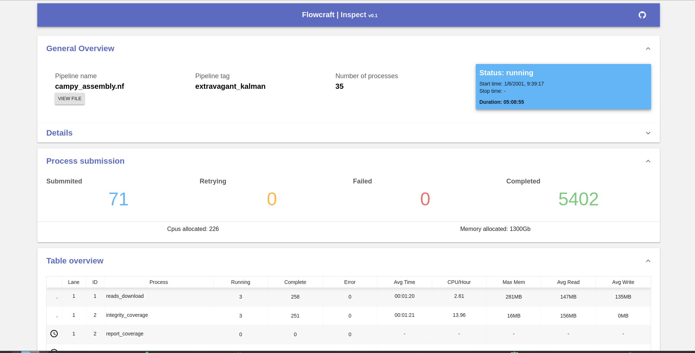

Basic Usage
===========

FlowCraft has currently two execution modes, ``build`` and ``inspect``, that are
used to build and inspect the nextflow pipeline, respectively. However, a
``report`` mode is also being developed.

Build
-----

Assembling a pipeline
:::::::::::::::::::::

Pipelines can be generated using the ``build`` execution mode of FlowCraft
and the ``-t`` parameter to specify the :ref:`components <components>` inside quotes::

    flowcraft build -t "trimmomatic fastqc spades" -o my_pipe.nf

All components should be written inside quotes and be space separated.
This command will generate a linear pipeline with three components on the
current working directory (for more features and tips on how pipelines can be
built, see the :doc:`pipeline building <pipeline_building>` section). A linear pipeline means that
there are no bifurcations between components, and the input data will flow
linearly. In this particular case, the input data of the
pipeline will be paired-end fastq files, since that is the input data type
of the first component, :doc:`trimmomatic <components/trimmomatic>`.

The rationale of how the data flows across the pipeline is simple and intuitive.
Data enters a component and is processed in some way, which may result on the
creation of results (stored in the ``results`` directory) and reports (stored
in the ``reports`` directory) (see `Results and reports`_ below). If that
component has an ``output_type``, it will feed the processed data into the
next component (or components) and this will repeated until the end of the
pipeline.

If you are interesting in checking the pipeline DAG tree, open the
``my_pipe.html`` file (same name as the pipeline with the html extension)
in any browser.

The ``integrity_coverage`` component is a dependency of ``trimmomatic``, so
it was automatically added to the pipeline.

.. note::
    Not all pipeline variations will work. **You always need to ensure
    that the output type of a component matches the input type of the next
    component**, otherwise FlowCraft will exit with an error.

Pipeline directory
::::::::::::::::::

In addition to the main nextflow pipeline file (``my_pipe.nf``),
FlowCraft will write several auxiliary files that are necessary for
the pipeline to run. The contents of the directory should look something like
this::

    $ ls
    bin                lib           my_pipe.nf       params.config     templates
    containers.config  my_pipe.html  nextflow.config  profiles.config   resources.config  user.config

You do not have to worry about most of these files. However, the
``*.config`` files can be modified to change several aspects of the pipeline run
(see :doc:`pipeline_configuration` for more details). Briefly:

- ``params.config``: Contains all the available parameters of the pipeline (see
  `Parameters`_ below). These can be changed here, or provided directly on
  run-time (e.g.: ``nextflow run --fastq value``).
- ``resources.config``: Contains the resource directives of the pipeline processes,
  such as cpus, allocated RAM and other nextflow process directives.
- ``containers.config``: Specifies the container and version tag of each process
  in the pipeline.
- ``profiles.config``: Contains a number of predefined profiles of executor and
  container engine.
- ``user.config``: Empty configuration file that is not over-written if you build
  another pipeline in the same directory. Used to set persistent configurations
  across different pipelines.

Parameters
::::::::::

The parameters of the pipeline can be viewed by running the pipeline file
with ``nextflow`` and using the ``--help`` option::

    $ nextflow run my_pipe.nf --help
    N E X T F L O W  ~  version 0.30.1
    Launching `my_pipe.nf` [kickass_mcclintock] - revision: 480b3455ba

    ============================================================
                    F L O W C R A F T
    ============================================================
    Built using flowcraft v1.2.1.dev1

    Usage:
        nextflow run my_pipe.nf

           --fastq                     Path expression to paired-end fastq files. (default: fastq/*_{1,2}.*) (default: 'fastq/*_{1,2}.*')

           Component 'INTEGRITY_COVERAGE_1_1'
           ----------------------------------
           --genomeSize_1_1            Genome size estimate for the samples in Mb. It is used to estimate the coverage and other assembly parameters andchecks (default: 1)
           --minCoverage_1_1           Minimum coverage for a sample to proceed. By default it's setto 0 to allow any coverage (default: 0)

           Component 'TRIMMOMATIC_1_2'
           ---------------------------
           --adapters_1_2              Path to adapters files, if any. (default: 'None')
           --trimSlidingWindow_1_2     Perform sliding window trimming, cutting once the average quality within the window falls below a threshold (default: '5:20')
           --trimLeading_1_2           Cut bases off the start of a read, if below a threshold quality (default: 3)
           --trimTrailing_1_2          Cut bases of the end of a read, if below a threshold quality (default: 3)
           --trimMinLength_1_2         Drop the read if it is below a specified length  (default: 55)

           Component 'FASTQC_1_3'
           ----------------------
           --adapters_1_3              Path to adapters files, if any. (default: 'None')

           Component 'SPADES_1_4'
           ----------------------
           --spadesMinCoverage_1_4     The minimum number of reads to consider an edge in the de Bruijn graph during the assembly (default: 2)
           --spadesMinKmerCoverage_1_4 Minimum contigs K-mer coverage. After assembly only keep contigs with reported k-mer coverage equal or above this value (default: 2)
           --spadesKmers_1_4           If 'auto' the SPAdes k-mer lengths will be determined from the maximum read length of each assembly. If 'default', SPAdes will use the default k-mer lengths.  (default: 'auto')

All these parameters are specific to the components of the pipeline. However,
the main input parameter (or parameters) of the pipeline is always available.
In this case, since the pipeline started with fastq paired-end files as the
main input, the ``--fastq`` parameter is available. If the pipeline started
with any other input type or with more than one input type, the appropriate
parameters would appear. These parameters can be provided on run-time or
edited in the ``params.config`` file.

It worth noting that, by default, all parameters will be independent between
different components, **even if the parameter name is the same**. This
behaviour can be changed when building the pipeline by using the
``--merge-params`` option (See :ref:`mergeParams`).

Executing the pipeline
::::::::::::::::::::::

Most parameters in FlowCraft's components already come with sensible
defaults, which means that usually you'll only need to provide a small number
of arguments. In the example above, the ``--fastq`` is the only parameter
required. I have placed fastq files on the ``data`` directory::

    $ ls data
    sample_1.fastq.gz  sample_2.fastq.gz

We'll need to provide the pattern to the fastq files. This pattern is perhaps
a bit confusing at first, but it's necessary for the correct inference of the
paired::

    nextflow run my_pipe.nf --fastq "data/*_{1,2}.*"

In this case, the pairs are separated by the "_1." or "_2." substring, which leads
to the pattern ``*_{1,2}.*``. Another common nomenclature for paired fastq
files is something like ``sample_R1_L001.fastq.gz``. In this case, an
acceptable pattern would be ``*_R{1,2}_*``.

.. important::

    Note the quotes around the fastq path pattern. These quotes are necessary
    to allow nextflow to resolve the pattern, otherwise your shell might try
    to resolve it and provide the wrong input to nextflow.

Changing executor and container engine
^^^^^^^^^^^^^^^^^^^^^^^^^^^^^^^^^^^^^^

The default run mode of an FlowCraft pipeline is to be executed locally
and using the singularity container engine. In nextflow terms, this is
equivalent to have ``executor = "local"`` and ``singularity.enabled = true``.
If you want to change these settings, you can modify the
``nextflow.config`` file, or use one of the available profiles in the
``profiles.config`` file. These profiles provide a combination of common
``<executor>_<container_engine>`` that are `supported by nextflow`_. Therefore,
if you want to run the pipeline on a cluster with SLURM and shifter, you'll
just need to specify the `` slurm_shifter`` profile::

    nextflow run my_pipe.nf --fastq "data/*_{1,2}.*" -profile slurm_shifter

Common executors include:

- ``slurm``
- ``sge``
- ``lsf``
- ``pbs``

Other container engines are:

- ``docker``
- ``singularity``
- ``shifter``

.. _supported by nextflow: https://www.nextflow.io/docs/latest/executor.html

Docker images
^^^^^^^^^^^^^

All components of FlowCraft are executed in containers, which means that
the first time they are executed in a machine, **the corresponding image will have
to be downloaded**. In the case of docker, images are pulled and stored in
``var/lib/docker`` by default. In the case of singularity, the
``nextflow.config`` generated by FlowCraft sets the cache dir for the
images at ``$HOME/.singularity_cache``. Note that when an image is downloading,
nextflow does not display any informative message, except for singularity where you'll
get something like::

    Pulling Singularity image docker://ummidock/trimmomatic:0.36-2 [cache /home/diogosilva/.singularity_cache/ummidock-trimmomatic-0.36-2.img]

So, if a process seems to take too long to run the first time, it's probably
because the image is being downloaded.

Results and reports
:::::::::::::::::::

As the pipeline runs, processes may write result and report files to the
``results`` and ``reports`` directories, respectively. For example, the
reports of the pipeline above, would look something like this::

    reports
    ├── coverage_1_1
    │   └── estimated_coverage_initial.csv
    ├── fastqc_1_3
    │   ├── FastQC_2run_report.csv
    │   ├── run_2
    │   │   ├── sample_1_0_summary.txt
    │   │   └── sample_1_1_summary.txt
    │   ├── sample_1_1_trim_fastqc.html
    │   └── sample_1_2_trim_fastqc.html
    └── status
        ├── master_fail.csv
        ├── master_status.csv
        └── master_warning.csv

The ``estimated_coverage_initial.csv`` file contains a very rough coverage
estimation for each sample, the ``fastqc*`` directory contains the html
reports and summary files of FastQC for each sample, and the ``status``
directory contains a log of the status, warnings and fails of each process for
each sample.

The actual results for each process that produces them, are stored in the
``results`` directory::

    results
    ├── assembly
    │   └── spades_1_4
    │       └── sample_1_trim_spades3111.fasta
    └── trimmomatic_1_2
        ├── sample_1_1_trim.fastq.gz
        └── sample_1_2_trim.fastq.gz

If you are interested in checking the actual environment where the execution
of a particular process occurred for any given sample, you can inspected the
``pipeline_stats.txt`` file in the root of the pipeline directory. This file
contains rich information about the execution of each process, including
the working directory::

    task_id hash        process         tag         status      exit    start                   container                           cpus    duration    realtime    queue   %cpu    %mem    rss     vmem
    5       7c/cae270   trimmomatic_1_2 sample_1    COMPLETED   0       2018-04-12 11:42:29.599 docker:ummidock/trimmomatic:0.36-2  2       1m 25s      1m 17s      -       329.3%  1.1%    1.5 GB  33.3 GB

The ``hash`` column contains the start of the current working directory of that
process. In the example below, the directory would be::

    work/7c/cae270*

Inspect
-------

FlowCraft has two options (``overview`` and ``broadcast``) for inspecting the
progress of a pipeline that is running locally, either in a personal computer
or a server machine. In both cases, the progress of the pipeline will be
continuously updated in real-time.

In a terminal
:::::::::::::

To open inspect in the terminal just write the following command **on the folder
that the pipeline is running**::

    flowcraft inspect

``overview`` is the default behavior of this module, but it can also be called
like this::

    flowcraft inspect -m overview

.. note::
    To exit the inspection just type ``q`` or ``ctrl+c``.

In a browser
::::::::::::

It is also possible to track the pipeline progress in a browser in any
device using the flowcraft web application. **To do so, the following command
should be run in the folder where the pipeline is running**::

    flowcraft inspect -m broadcast

This will output a url to the terminal that can be opened in a browser.
This is an example of the screen that is displayed once the url is opened:

.. important::
    This pipeline inspection will be available for **anyone** via the provided URL,
    which means that the URL can be shared with anyone and/or any device with
    a browser. **However, the inspection section will only be available while
    the** ``flowcraft inspect -m broadcast`` **command is running. Once this command
    is cancelled, the data will be erased from the service and the URL will
    no longer be available**.

Want to know more?
::::::::::::::::::

:doc:`pipeline_inspect` is the full documentation of the ``inspect`` mode.

Reports
-------

Coming soon...
