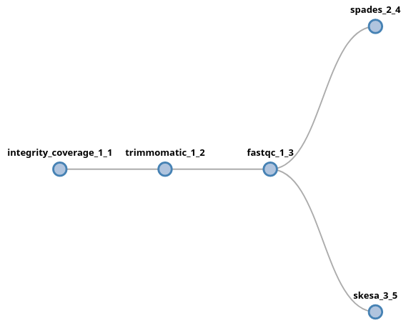
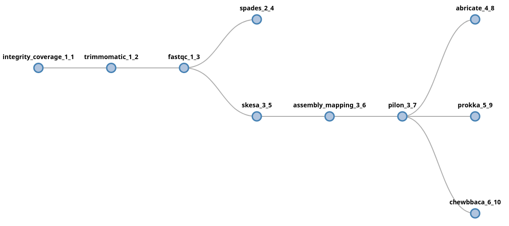
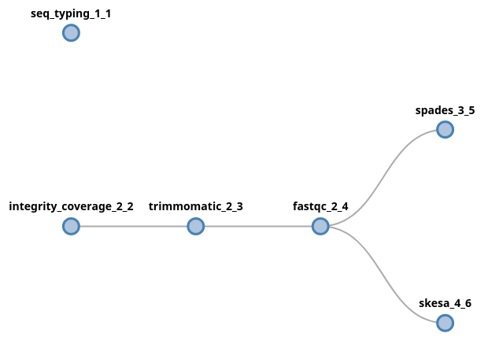

Pipeline building
=================

FlowCraft offers a few extra features when building pipelines using the
``build`` execution mode.

Raw input types
---------------

The first component (or components) you place at the start of the pipeline
determine the raw input type, and the parameter for providing input data.
The input type information is provided in the documentation page of each
component. For instance, if the first component is FastQC, which has an input
type of ``FastQ``, the parameter for providing the raw input data will be
``--fasta``. Here are the currently supported input types and their
respective parameters:

- ``FastQ``: ``--fastq``
- ``Fasta``: ``--fasta``
- ``Accessions``: ``--accessions``

.. _mergeParams:

Merge parameters
----------------

By default, parameters in a FlowCraft pipeline are unique and independent
between different components, even if the parameters have the same name and/or
the components are the same. This allows for the execution of the same software
using different parameters in a single workflow. The ``params.config`` of these
pipelines will look something like::

    params {
        /*
        Component 'trimmomatic_1_2'
        --------------------------
        */
        adapters_1_2 = 'None'
        trimSlidingWindow_1_2 = '5:20'
        trimLeading_1_2 = 3
        trimTrailing_1_2 = 3
        trimMinLength_1_2 = 55

        /*
        Component 'fastqc_1_3'
        ---------------------
        */
        adapters_1_3 = 'None'
    }

Notice that the ``adapters`` parameter occurs twice and can be independently set
in each component.

If you want to override this behaviour, FlowCraft has a ``--merge-params`` option
that merges all parameters with the same name in a single parameter, which is then
equally applied to all components. So, if we generate the pipeline above
with this option::

    flowcraft build -t "trimmomatic fastqc" -o pipe.nf --merge-params

Then, the ``params.config`` will become::

    params {
        adapters = 'None'
        trimSlidingWindow = '5:20'
        trimLeading = 3
        trimTrailing = 3
        trimMinLength = 5
    }

Forks
-----

The output of any component in an FlowCraft pipeline can be forked into
two or more components, using the following fork syntax::

    trimmomatic fastqc (spades | skesa)

In this example, the output of ``fastqc`` will be fork into two new *lanes*,
which will proceed independently from each other. In this syntax, a fork is
triggered by the ``(`` symbol (and the corresponding closing ``)``) and each
lane will be separated by a ``|`` symbol. There is no limitation to the number
of forks or lanes that a pipeline has. For instance, we could add more
components after the ``skesa`` module, including another fork::

    trimmomatic fastqc (spades | skesa pilon (abricate | prokka | chewbbaca))

In this example, data will be forked after ``fastqc`` into two new lanes,
processed by ``spades`` and ``skesa``. In the skesa lane, data will continue
to flow into the ``pilon`` component and its output will fork into three new
lanes.

It is also possible to start a fork at the beggining of the pipeline, which
basically means that the pipeline will have multiple starting points. If we
want to provide the raw input two multiple process, the fork syntax can start
at the beginning of the pipeline::

    (seq_typing | trimmomatic fastqc (spades | skesa))

In this case, since both initial components (``seq_typing`` and
``integrity_coverage``) received fastq files as input, the data provided
via the ``--fastq`` parameter will be forked and provided to both processes.

.. note::
    Some components have dependencies which need to be included previously
    in the pipeline. For instance, ``trimmomatic`` requires
    ``integrity_coverage`` and ``pilon`` requires ``assembly_mapping``. By
    default, FlowCraft will insert any missing dependencies right before
    the process, which is why these components appear in the figures above.

.. warning::
    Pay special attention to the syntax of the pipeline string when using
    forks. However, when unable to parse it, FlowCraft will do its best
    to inform you where the parsing error occurred.

Directives
----------

Several directives with information on cpu usage, RAM, version, etc. can be
specified for each individual component when building the pipeline using the
``={}`` notation. These
directives are written to the ``resources.config`` and
``containers.config`` files that are generated in the pipeline directory. You
can pass any of the directives already supported by nextflow (https://www.nextflow.io/docs/latest/process.html#directives),
but the most commonly used include:

    - ``cpus``
    - ``memory``
    - ``queue``

In addition, you can also pass the ``container`` and ``version`` directives
which are parsed by FlowCraft to dynamically change the container and/or
version tag of any process.

Here is an example where we specify cpu usage, allocated memory and container
version in the pipeline string::

    flowcraft build -t "fastqc={'version':'0.11.5'} \
                            trimmomatic={'cpus':'2'} \
                            spades={'memory':'\'10GB\''}" -o my_pipeline.nf

When a directive is not specified, it will assume the default value of the
nextflow directive.

.. warning::
    Take special care not to include any white space characters inside the
    directives field. Common mistakes occur when specifying directives like
    ``fastqc={'version': '0.11.5'}``.

.. note::
    The values specified in these directives are placed in the
    respective config files exactly as they are. For instance,
    ``spades={'memory':'10GB'}"`` will appear in the config as
    ``spades.memory = 10Gb``, which will raise an error in nextflow because
    ``10Gb`` should be a string. Therefore, if you want a string you'll need to add
    the ``'`` as in this example: ``spades={'memory':'\'10GB\''}"``. The
    reason why these directives are not automatically converted is to allow
    the specification of dynamic computing resources, such as
    ``spades={'memory':'{10.Gb*task.attempt}'}"``

Extra inputs
------------

By default, only the first process (or processes) in a pipeline will receive
the raw input data provided by the user. However, the ``extra_input`` special
directive allows one or more processes to receive input from an additional parameter
that is provided by the user::

    reads_download integrity_coverage={'extra_input':'local'} trimmomatic spades

The default main input of this pipeline is a text file with accession numbers
for the ``reads_download`` component. The ``extra_input`` creates
a new parameter, named ``local`` in this example, that allows us to provide
additional input data to the ``integrity_coverage`` component directly::

    nextflow run pipe.nf --accessions accession_list.txt --local "fastq/*_{1,2}.*"

What will happen in this pipeline, is that the fastq files provided to the
``integrity_coverage`` component will be mixed with the ones provided by the
``reads_download`` component. Therefore, if we provide 10 accessions and 10
fastq samples, we'll end up with 20 samples being processed by the end of the
pieline.

**It is important to note that the extra input parameter expected data
compliant with the input type of the process.** If files other than fastq files
would be provided in the pipeline above, this would result in a pipeline error.

If the ``extra_input`` directive is used on a component that has a different
input type from the first component in the pipeline, it is possible to use
the ``default`` value::

    trimmomatic spades abricate={'extra_input':'default'}

In this case, the input type of the first component if fastq and the input
type of ``abricate`` is fasta. The ``default`` value will make available the
default parameter for fasta raw input, which is ``fasta``::

    nextflow run pipe.nf --fastq "fastq/*_{1,2}.*" --fasta "fasta/*.fasta"

Pipeline file
-------------

Instead of providing the pipeline components via the command line, you can
specify them in a text file::

    # my_pipe.txt
    trimmomatic fastqc spades

And then provide the pipeline file to the ``-t`` parameter::

    flowcraft build -t my_pipe.txt -o my_pipe.nf

Pipeline files are usually more readable, particularly when they become more
complex. Consider the following example::

    integrity_coverage (
        spades={'memory':'\'50GB\''} |
        skesa={'memory':'\'40GB\'','cpus':'4'} |
        trimmomatic fastqc (
            spades pilon (abricate={'extra_input':'default'} | prokka) |
            skesa pilon (abricate | prokka)
        )
    )

In addition to be more readable, it is also easier to edit, re-use and share.

